# Checkout Flow Diagrams

## 1. Complete Checkout User Journey

```mermaid
flowchart TD
    Start([User on Product Page]) --> AddCart[Add Item to Cart]
    AddCart --> ViewCart{View Cart?}
    
    ViewCart -->|Yes| CartPage[Cart Page]
    ViewCart -->|No| Continue[Continue Shopping]
    Continue --> Start
    
    CartPage --> CheckCart{Cart Empty?}
    CheckCart -->|Yes| EmptyMsg[Show Empty Message]
    CheckCart -->|No| ProceedCheckout[Click 'Go to Checkout']
    
    EmptyMsg --> Start
    
    ProceedCheckout --> CheckoutPage[/Checkout Page Loads/]
    CheckoutPage --> CheckAuth{User Logged In?}
    
    CheckAuth -->|No| GuestCheckout[Guest Checkout]
    CheckAuth -->|Yes| LoadAddress[Load Saved Addresses]
    
    GuestCheckout --> AddressForm
    LoadAddress --> ShowSaved[Show Saved Addresses]
    ShowSaved --> SelectSaved{Select Saved?}
    
    SelectSaved -->|Yes| PopulateForm[Populate Form]
    SelectSaved -->|No| AddressForm
    
    PopulateForm --> AddressForm[📍 Address Form]
    
    AddressForm --> FillRequired[Fill Required Fields:<br/>✓ Name<br/>✓ Address<br/>✓ Police Station<br/>✓ District<br/>✓ Phone]
    
    FillRequired --> ValidateForm{Form Valid?}
    
    ValidateForm -->|No| ShowErrors[Show Validation Errors]
    ShowErrors --> FillRequired
    
    ValidateForm -->|Yes| SubmitAddress[Click 'Continue to Delivery']
    
    SubmitAddress --> SaveAddress[Save Address to Backend]
    SaveAddress --> AddressSaved{Saved Successfully?}
    
    AddressSaved -->|No| SaveError[Show Error Message]
    SaveError --> FillRequired
    
    AddressSaved -->|Yes| ShippingStep[🚚 Shipping Method Step]
    
    ShippingStep --> LoadShipping[Load Available Methods]
    LoadShipping --> SelectShipping[Select Shipping Method]
    SelectShipping --> ShippingSelected[Shipping Method Saved]
    
    ShippingSelected --> PaymentStep[💳 Payment Method Step]
    
    PaymentStep --> LoadPayment[Load Payment Methods]
    LoadPayment --> SelectPayment{Select Payment}
    
    SelectPayment -->|Cash on Delivery| CODSelected[COD Selected]
    SelectPayment -->|Credit Card| StripeSelected[Stripe Selected]
    
    CODSelected --> ReviewOrder
    StripeSelected --> EnterCard[Enter Card Details]
    EnterCard --> ValidateCard{Card Valid?}
    
    ValidateCard -->|No| CardError[Show Card Error]
    CardError --> EnterCard
    ValidateCard -->|Yes| ReviewOrder
    
    ReviewOrder[📋 Review Order]
    ReviewOrder --> CheckReview{All Complete?}
    
    CheckReview -->|No| ReviewError[Place Order Button<br/>Disabled]
    ReviewError -->|Fix Issues| AddressForm
    
    CheckReview -->|Yes| PlaceOrderBtn[Place Order Button<br/>Enabled ✓]
    
    PlaceOrderBtn --> ClickPlace[User Clicks<br/>'Place Order']
    ClickPlace --> ProcessOrder[Process Order]
    
    ProcessOrder --> PaymentProcess{Payment Type}
    
    PaymentProcess -->|COD| MarkPending[Mark Payment Pending]
    PaymentProcess -->|Stripe| ChargeCard[Charge Credit Card]
    
    ChargeCard --> CardSuccess{Payment Success?}
    CardSuccess -->|No| PaymentFailed[Payment Failed]
    PaymentFailed --> PaymentStep
    
    CardSuccess -->|Yes| CreateOrder
    MarkPending --> CreateOrder[Create Order in DB]
    
    CreateOrder --> OrderCreated{Order Created?}
    
    OrderCreated -->|No| OrderError[Show Error Message]
    OrderError --> ReviewOrder
    
    OrderCreated -->|Yes| SendEmail[Send Confirmation Email]
    SendEmail --> Confirmation[✅ Order Confirmation Page]
    
    Confirmation --> ShowOrderDetails[Show Order Details:<br/>• Order Number<br/>• Items<br/>• Total<br/>• Delivery Address]
    ShowOrderDetails --> End([Checkout Complete])
    
    style Start fill:#e1f5ff
    style AddressForm fill:#ffd43b
    style ShippingStep fill:#90ee90
    style PaymentStep fill:#ff9999
    style ReviewOrder fill:#c7b3ff
    style Confirmation fill:#90ee90
    style End fill:#90ee90
```

## 2. Address Form Component Flow

## 3. Payment Processing Flow

## 4. Component State Management

## 5. Form Validation Flow

## 6. Cart to Order Transformation

## 7. Error Handling Flow

## 8. Recent Bug Fix - Input Clearing Issue

```mermaid
flowchart TD
    subgraph "Before Fix ❌"
        B1[User Types in Form]
        B2[Cart State Updates]
        B3[useEffect Triggered]
        B4[Form Data Reset]
        B5[User Input Lost]
        
        B1 --> B2
        B2 --> B3
        B3 --> B4
        B4 --> B5
    end
    
    subgraph "After Fix ✅"
        A1[User Types in Form]
        A2[Cart State Updates]
        A3[useEffect Checks If Form Empty]
        A4{Form<br/>Has Data?}
        A5[Skip Reset]
        A6[Keep User Input]
        
        A1 --> A2
        A2 --> A3
        A3 --> A4
        A4 -->|Yes| A5
        A4 -->|No| Reset[Reset from Cart]
        A5 --> A6
    end
    
    subgraph "Code Change"
        Before["useEffect(() => {<br/>  setFormAddress(cart.address)<br/>}, [cart])"]
        After["useEffect(() => {<br/>  if (!hasFormData) {<br/>    setFormAddress(cart.address)<br/>  }<br/>}, [])"]
    end
    
    B5 -.Problem.-> After
    
    style B4 fill:#ff9999
    style B5 fill:#ff9999
    style A5 fill:#90ee90
    style A6 fill:#90ee90
    style After fill:#90ee90
```

---

**Note**: These diagrams visualize the complete checkout flow including all steps, validations, error handling, and the recent bug fixes implemented.