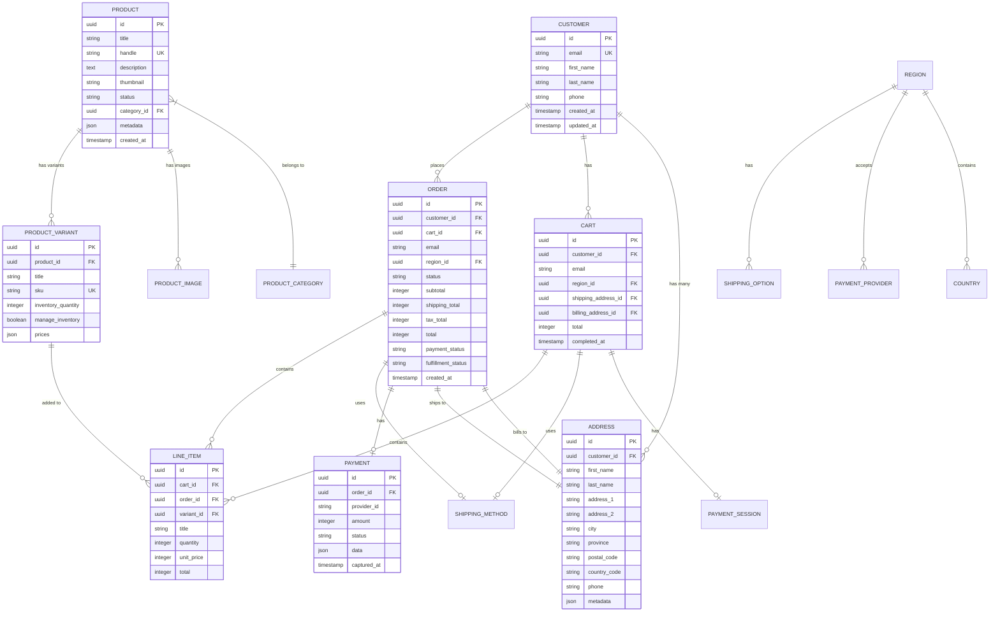
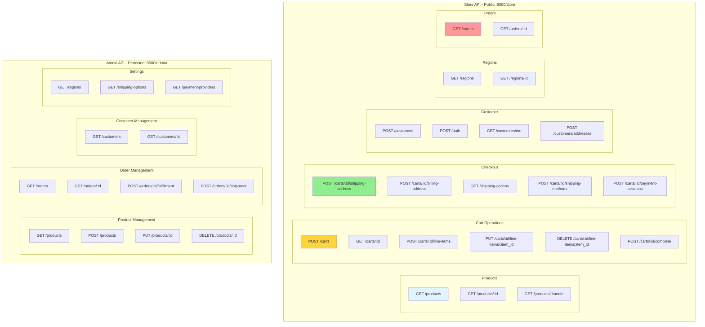
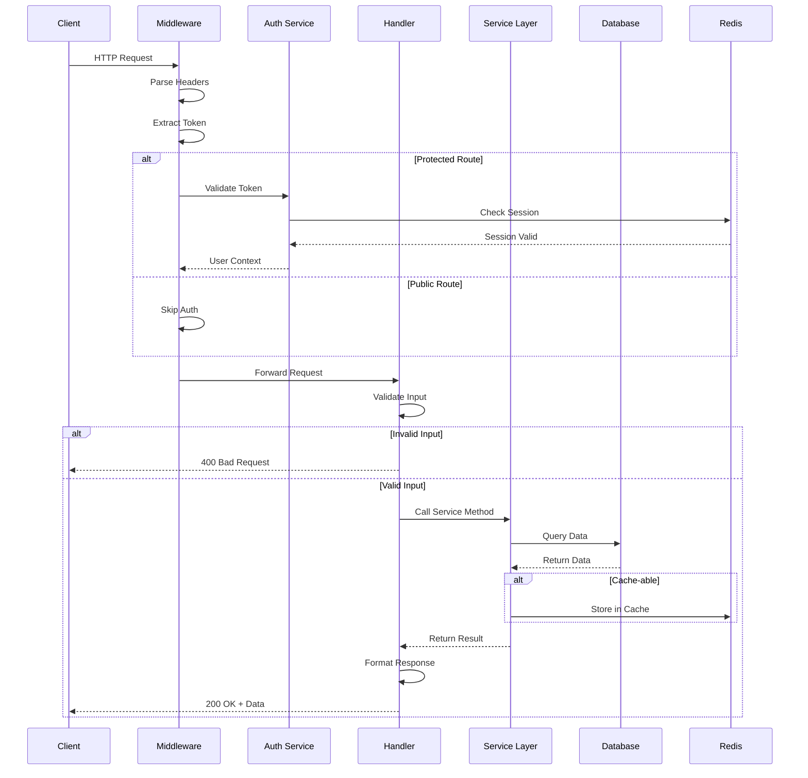
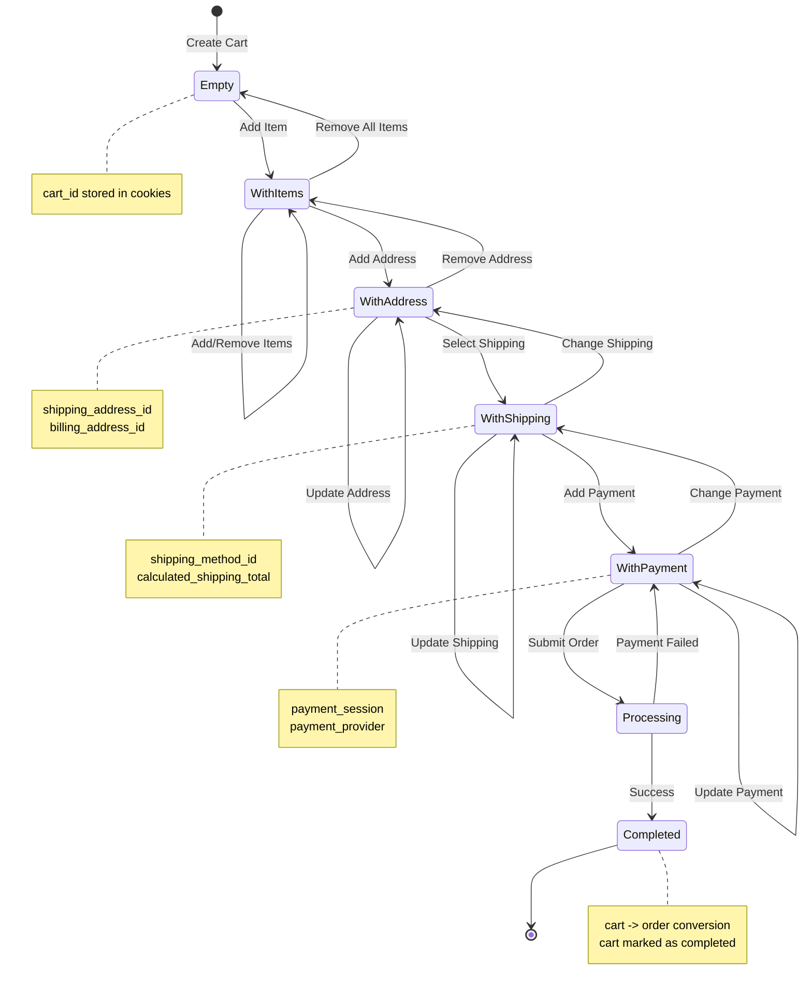
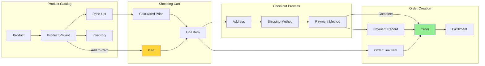
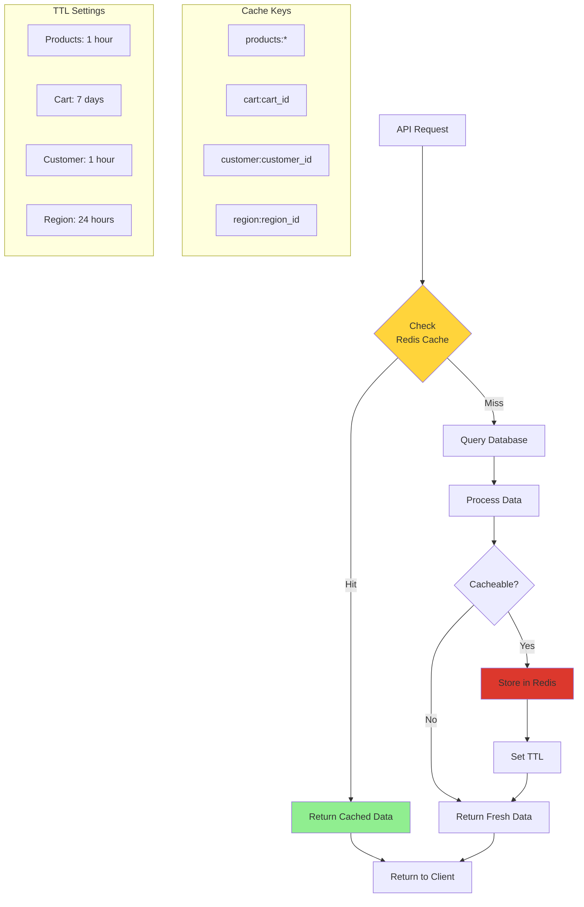
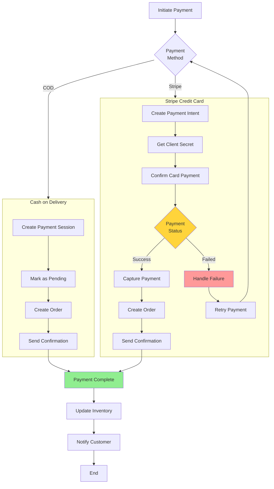
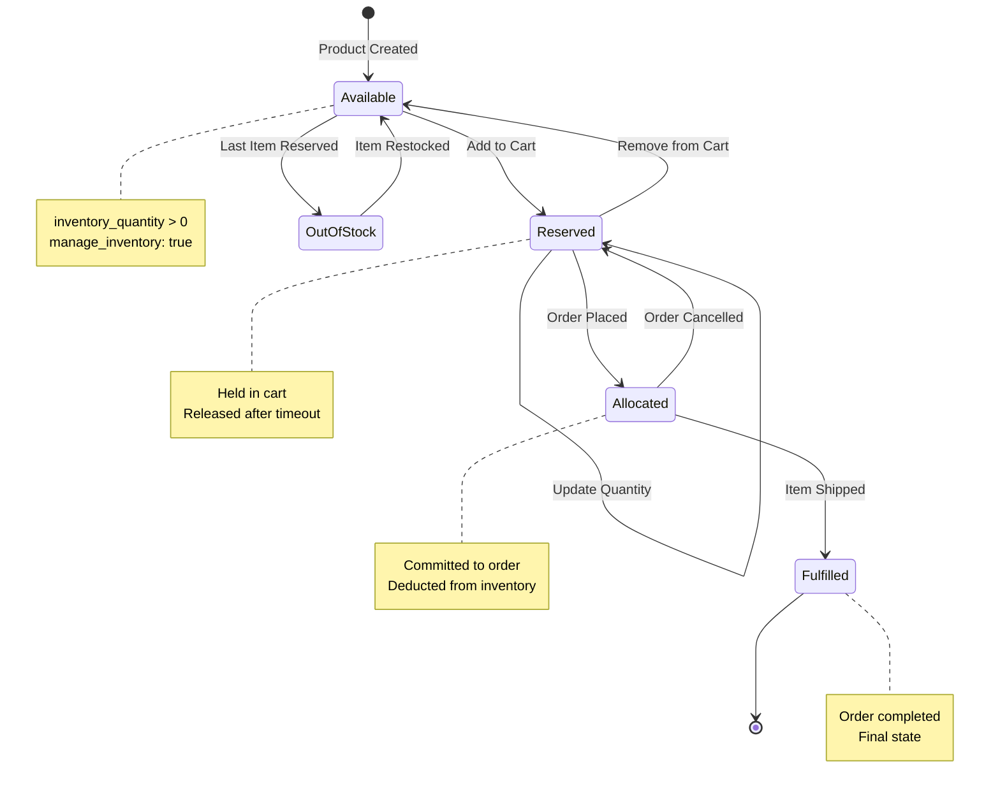
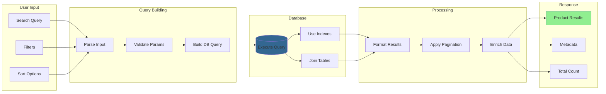
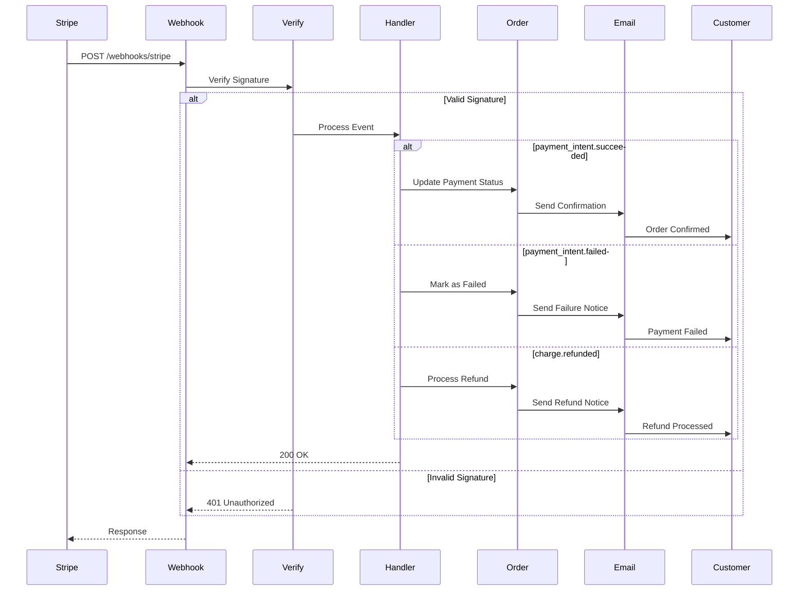

# Database and API Diagrams

## 1. Database Schema Overview

## 2. API Endpoint Structure

## 3. API Request/Response Flow

## 4. Cart State Management

## 5. Data Flow - Product to Order

## 6. Cache Strategy

## 7. Payment Processing Flow

## 8. Inventory Management

## 9. Search and Filter Flow

## 10. Webhook Event Flow

---

**Note**: These diagrams cover the database structure, API endpoints, data flows, caching strategies, payment processing, inventory management, and webhook handling.