# Frontend Components and User Interaction Diagrams

## 1. Next.js App Router Structure

```mermaid
graph TB
    subgraph "Root Layout"
        Root[app/layout.tsx]
        RootMeta[Metadata & Fonts]
    end
    
    subgraph "Country-Based Routing"
        Country["[countryCode]/"]
        CountryLayout[layout.tsx]
        
        subgraph "Main Layout Routes"
            MainLayout["(main)/layout.tsx"]
            Nav[Navigation Bar]
            Footer[Footer]
            
            HomePage[page.tsx - Home]
            CartPage[cart/page.tsx]
            ProductsPage["products/[handle]/page.tsx"]
            CategoriesPage["categories/[...category]/page.tsx"]
            CollectionsPage["collections/[handle]/page.tsx"]
            AccountPage[account/@dashboard/page.tsx]
            OrderPage["order/[id]/confirmed/page.tsx"]
        end
        
        subgraph "Checkout Layout Routes"
            CheckoutLayout["(checkout)/layout.tsx"]
            CheckoutNav[Minimal Navigation]
            CheckoutPage[checkout/page.tsx]
        end
    end
    
    Root --> RootMeta
    Root --> Country
    Country --> CountryLayout
    CountryLayout --> MainLayout
    CountryLayout --> CheckoutLayout
    
    MainLayout --> Nav
    MainLayout --> Footer
    MainLayout --> HomePage
    MainLayout --> CartPage
    MainLayout --> ProductsPage
    MainLayout --> CategoriesPage
    MainLayout --> CollectionsPage
    MainLayout --> AccountPage
    MainLayout --> OrderPage
    
    CheckoutLayout --> CheckoutNav
    CheckoutLayout --> CheckoutPage
    
    style CheckoutPage fill:#ffd43b
    style HomePage fill:#90ee90
    style CartPage fill:#e1f5ff
```

## 2. Component Hierarchy - Home Page


## 3. Component Hierarchy - Product Page


## 4. Component Hierarchy - Cart Page


## 5. Component Hierarchy - Checkout Page

```mermaid
graph TD
    CheckoutPage[Checkout Page] --> CheckoutForm[Checkout Form]
    CheckoutPage --> OrderSummary[Order Summary Sidebar]
    
    subgraph "Checkout Form Components"
        CheckoutForm --> Addresses[Addresses Component]
        CheckoutForm --> Shipping[Shipping Component]
        CheckoutForm --> Payment[Payment Component]
        CheckoutForm --> Review[Review Component]
        
        Addresses --> AddressState{Address State}
        AddressState -->|Open| AddressForm[Shipping Address Form]
        AddressState -->|Closed| AddressSummary[Address Summary]
        
        AddressForm --> NameInput[Name Input]
        AddressForm --> AddressInput[Address Input]
        AddressForm --> PoliceStationInput[Police Station Input ⭐]
        AddressForm --> DistrictInput[District Input]
        AddressForm --> PhoneInput[Phone Input]
        AddressForm --> EmailInput[Email Input]
        AddressForm --> BillingCheckbox[Same as Billing Checkbox]
        AddressForm --> SubmitAddressBtn[Continue to Delivery]
        
        Shipping --> ShippingOptions[Shipping Options List]
        ShippingOptions --> StandardOption[Standard Shipping]
        ShippingOptions --> ExpressOption[Express Delivery]
        ShippingOptions --> FreeOption[Free Shipping]
        
        Payment --> PaymentMethods[Payment Methods]
        PaymentMethods --> CODOption[Cash on Delivery]
        PaymentMethods --> StripeOption[Credit/Debit Card]
        
        StripeOption --> CardElement[Stripe Card Element]
        
        Review --> ReviewItems[Review Items]
        Review --> ReviewAddress[Review Address]
        Review --> ReviewShipping[Review Shipping]
        Review --> PlaceOrderBtn[Place Order Button]
    end
    
    OrderSummary --> SummaryItems[Items List]
    OrderSummary --> SummaryPricing[Pricing Breakdown]
    OrderSummary --> DiscountCode[Discount Code Input]
    
    SummaryPricing --> ItemsTotal[Items Total]
    SummaryPricing --> ShippingCost[Shipping Cost]
    SummaryPricing --> TaxAmount[Tax Amount]
    SummaryPricing --> GrandTotal[Grand Total]
    
    PlaceOrderBtn --> ProcessOrder[Process Order]
    ProcessOrder --> ConfirmationPage[Order Confirmation]
    
    style CheckoutPage fill:#ffd43b
    style AddressForm fill:#ffe6e6
    style PoliceStationInput fill:#90ee90
    style PlaceOrderBtn fill:#90ee90
    style ConfirmationPage fill:#90ee90
```



## 6. State Management Flow


## 7. User Interaction Flow - Shopping Journey


## 8. Responsive Design Breakpoints


## 9. Event Handling Flow


## 10. Performance Optimization Strategy


## 11. Error Boundary Structure


## 12. Accessibility (a11y) Implementation


---

**Note**: These diagrams visualize the frontend component structure, user interactions, state management, responsive design, performance optimizations, and accessibility features.