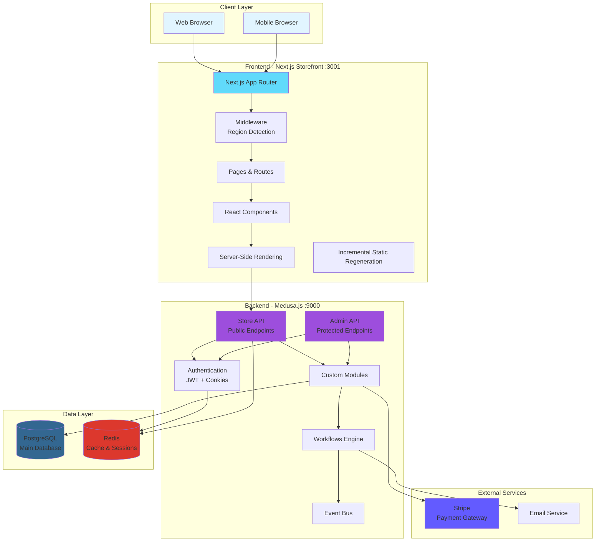
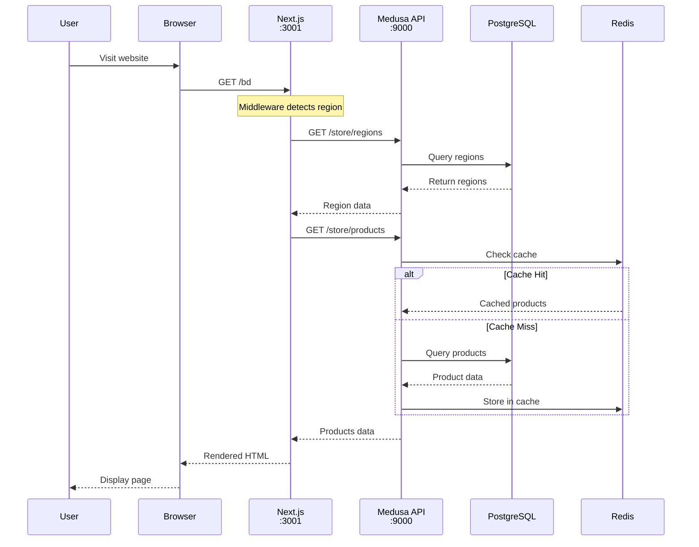
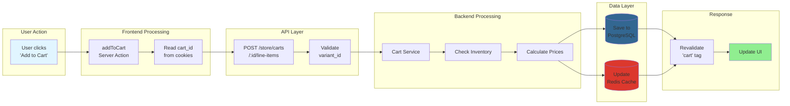
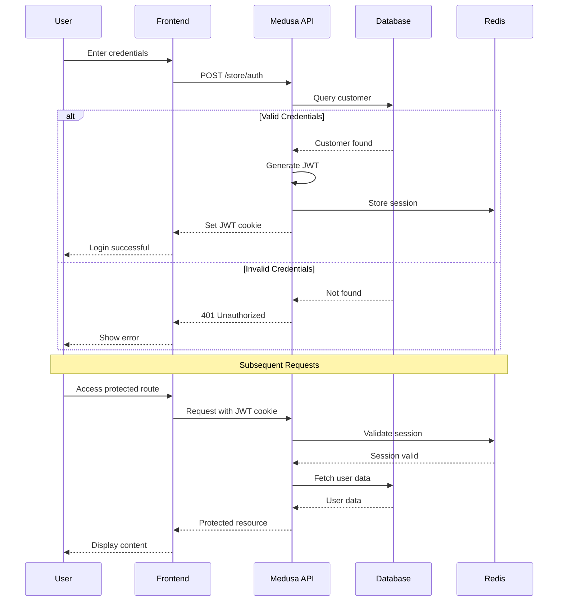
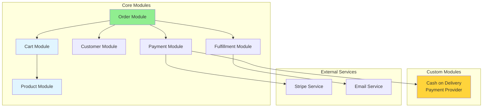
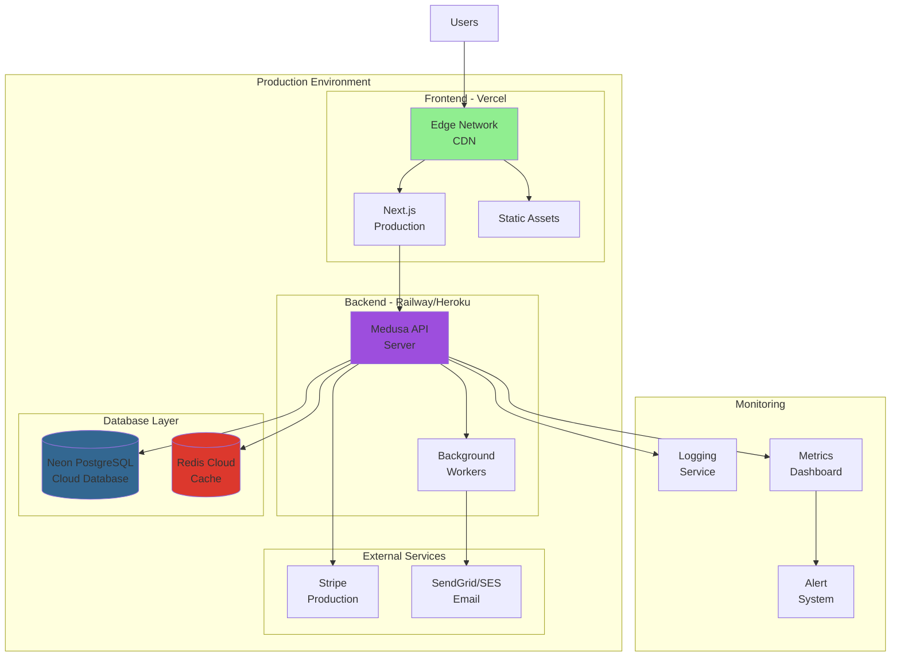
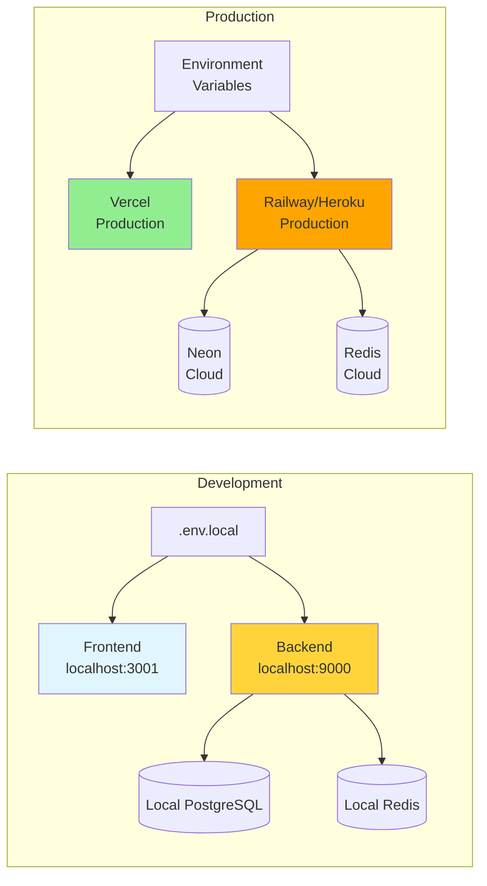

# System Architecture Diagrams

## 1. High-Level System Architecture



## 2. Request Flow Architecture



## 3. Component Architecture

```mermaid
graph TD
    subgraph "Next.js App Structure"
        Root[app/]
        Layout[layout.tsx]
        Country[countryCode/]
        
        subgraph "Main Layout"
            MainLayout[(main)/layout.tsx]
            Home[page.tsx - Home]
            Cart[cart/page.tsx]
            Products[products/]
            Account[account/]
            Order[order/]
        end
        
        subgraph "Checkout Layout"
            CheckoutLayout[(checkout)/layout.tsx]
            CheckoutPage[checkout/page.tsx]
        end
    end
    
    Root --> Layout
    Layout --> Country
    Country --> MainLayout
    Country --> CheckoutLayout
    
    MainLayout --> Home
    MainLayout --> Cart
    MainLayout --> Products
    MainLayout --> Account
    MainLayout --> Order
    
    CheckoutLayout --> CheckoutPage
    
    subgraph "Modules"
        HomeModule[modules/home/]
        CartModule[modules/cart/]
        CheckoutModule[modules/checkout/]
        ProductModule[modules/products/]
        AccountModule[modules/account/]
        LayoutModule[modules/layout/]
    end
    
    Home -.uses.-> HomeModule
    Cart -.uses.-> CartModule
    CheckoutPage -.uses.-> CheckoutModule
    Products -.uses.-> ProductModule
    Account -.uses.-> AccountModule
    
    style CheckoutModule fill:#ffd43b
    style CheckoutPage fill:#ffd43b
```

## 4. Data Flow - Add to Cart



## 5. Authentication Flow



## 6. Module Dependencies



## 7. Deployment Architecture



## 8. Environment Configuration Flow



---

**Note**: These diagrams use Mermaid syntax and will render automatically on GitHub, GitLab, and many markdown viewers.